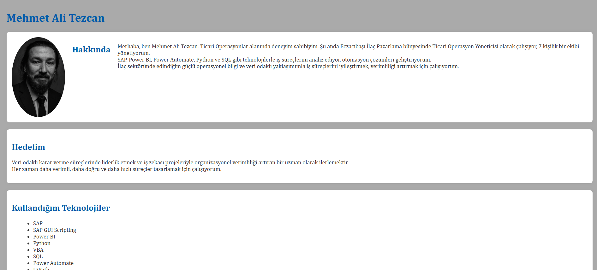

# Mehmet Ali Tezcan - Kişisel Web Sayfası

Bu proje, HTML5 ve temel CSS kullanarak hazırlanmış kişisel bir tanıtım sayfasıdır. Sayfa, özgeçmiş (CV) yapısında tasarlanmıştır ve aşağıdaki bölümleri içerir:

## 🔍 İçerik

- **Profil Fotoğrafı** ve **Hakkında** kısmı (yan yana görünüm)
- **Hedeflerim**
- **Kullandığım Teknolojiler** (sırasız liste)
- **İş Deneyimleri** (tarihe göre sıralı liste)
- **İletişim** (sosyal medya bağlantıları)
- **Google Maps iFrame** (şirket konumu)

## 💻 Kullanılan Teknolojiler

- HTML5
- CSS (dahili `<style>` kullanımı)
- Flexbox ile yatay düzen
- iFrame ile harita yerleştirme
- `<ul>`, `<ol>`, ``, `<a>`, `<section>`, `
` gibi temel HTML etiketleri

## 🖼️ Ekran Görüntüsü

> 
